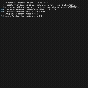

# Redis Clone in C++

Redis is an open source in-memory key value database which is widely used in applications requiring caching, session storage, rate limiting, and real-time applications due to it's very high read/write performance. In this project, I habe implemented a Redis inspired clone built in C++. It features core database functionality like TCP client-server communication, command parsing, persistence, TTL expiration, multithreading, and thread safe in-memory storage.

---

## Demo

<!-- Add demo GIF below -->


---

## Features

- TCP socket server
- Multithreaded client handling
- In-memory key-value store
- Persistence to disk (`dump.rdb`)
- TTL expiration support
- Thread-safe operations with mutex locks
- Local benchmarking script

---

## Supported Commands

```bash
PING
SET key value
GET key
DEL key
EXPIRE key seconds
EXISTS key
KEYS
```

---

## Build

```bash
mkdir build
cd build
cmake ..
make
./redis_clone
```

---

## Connect to Server

```bash
nc localhost 6379
```

---

## Benchmark

Run local throughput benchmark:

```bash
python3 benchmark.py
```

Example result:

```bash
Requests: 1000
Elapsed: 0.2278s
Requests/sec: 4389.49
```

Achieved **4,000+ requests/sec** in local testing.

---

## Architecture

```text
Client
   ↓
TCP Socket Server
   ↓
Command Parser
   ↓
Database Engine
   ↓
Persistence Layer
```

---

## Tech Stack

- C++20
- CMake
- POSIX sockets
- std::thread multithreading
- mutex synchronization
- unordered_map in-memory storage

---

## Future Improvements

- LRU eviction policy
- Publish/Subscribe messaging
- Replication support
- Additional benchmarking and unit tests